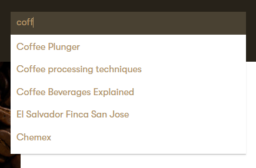

# Build a Search UI

## Autocomplete

### Create an autocomplete search box

Algolia provides [autocomplete](https://www.algolia.com/doc/ui-libraries/autocomplete/introduction/what-is-autocomplete/) functionality via javascript which you can [install](https://www.algolia.com/doc/ui-libraries/autocomplete/introduction/getting-started/#installation) and set up according to your preferences. Below is an example of how to add autocomplete functionality to the Dancing Goat sample site.

In the `/_Layout.cshtml` view which is rendered for every page, add a reference to Algolia's scripts and the default theme for autocomplete:

```cshtml
<script src="//cdn.jsdelivr.net/algoliasearch/3/algoliasearch.min.js"></script>
<script src="//cdn.jsdelivr.net/autocomplete.js/0/autocomplete.min.js"></script>
<link rel="stylesheet" href="https://cdn.jsdelivr.net/npm/@@algolia/autocomplete-theme-classic"/>
```

Add an input for the autocomplete search box under the `<ul class="additional-menu">` element:

```html
<li class="search-menu-item">
  <div class="searchBox">
    <input id="search-input" placeholder="Search" />
  </div>
</li>
```

Load the Algolia keys from `appsettings.json`:

```cshtml
@using Microsoft.Extensions.Options
@inject IOptions<AlgoliaOptions> options

@{
    var algoliaOptions = options.Value;
}
```

Add a script near the end of the `<body>` which loads your Algolia index. Be sure to use your **Search API Key** which is public!

```js
<script type="text/javascript">
  const client = algoliasearch('@algoliaOptions.ApplicationId',
  '@algoliaOptions.SearchKey'); const index =
  client.initIndex('@SiteSearchModel.IndexName');
</script>
```

Initialize the autocomplete search box, then create a handler for when users click on autocomplete suggestions, and when the _Enter_ button is used:

```js
var autocompleteBox = autocomplete("#search-input", { hint: false }, [
  {
    source: autocomplete.sources.hits(index, { hitsPerPage: 5 }),
    displayKey: "DocumentName", // The Algolia attribute used to display the title of a suggestion
  },
]).on("autocomplete:selected", function (event, suggestion, dataset) {
  window.location = suggestion.Url; // Navigate to the clicked suggestion
});

document.querySelector("#search-input").addEventListener("keyup", (e) => {
  if (e.key === "Enter") {
    // Navigate to search results page when Enter is pressed
    var searchText = document.querySelector("#search-input").value;
    window.location =
      '@(Url.Action("Search", "Search"))?searchtext=' + searchText;
  }
});
```

When you build and run the Dancing Goat website and start typing into the search box, records from the Algolia index will be suggested:



### Customize the autocomplete search box

In our sample implementation of the Algolia autocomplete search box,the standard [Autocomplete classic theme](https://www.algolia.com/doc/ui-libraries/autocomplete/introduction/getting-started/#install-the-autocomplete-classic-theme) was used for basic styling of the search box and the autocomplete suggestion layout. You can reference the theme's [CSS classes and variables](https://www.algolia.com/doc/ui-libraries/autocomplete/api-reference/autocomplete-theme-classic/) to customize the appearance of the search box to match the design of your website.

In the Dancing Goat website, you can add the following to the CSS which styles the search box and suggestions to match the Dancing Goat theme:

```css
/*# Algolia search box #*/
.searchBox .aa-dropdown-menu {
  background-color: #fff;
  padding: 5px;
  top: 120% !important;
  width: 100%;
  box-shadow: 0 1px 0 0 rgba(0, 0, 0, 0.2), 0 2px 3px 0 rgba(0, 0, 0, 0.1);
}
.searchBox .algolia-autocomplete {
  width: 100%;
}

.searchBox .aa-input {
  width: 100%;
  background-color: transparent;
  padding-left: 10px;
  padding-top: 5px;
}

.searchBox .aa-suggestion {
  padding: 5px 5px 0;
}

.searchBox .aa-suggestion em {
  color: #4098ce;
}

.searchBox .aa-suggestion.aa-cursor {
  background: #eee;
  cursor: pointer;
}
```

The layout of each individual suggestion can be customized by providing a [custom template](https://www.algolia.com/doc/ui-libraries/autocomplete/core-concepts/templates/) in the `autocomplete()` function. In the Dancing Goat website, you can add an image to each suggestion and highlight the matching search term by adding the following to your script:

```js
const autocompleteBox = autocomplete('#search-input', {hint: false}, [
{
    source: autocomplete.sources.hits(index, {hitsPerPage: 5}),
    templates: {
        suggestion: (item) =>
            `<span>${item._highlightResult.DocumentName.value}</span>`
    }
}
```

> The attributes `DocumentName` and `Thumbnail` used in this example are not present in all Algolia indexes! If you follow this example, make sure you are using attributes present in your index. See the [sample search model](#gear-creating-and-registering-an-algolia-index) to find out how these attributes were defined.

## Faceted search

As the search interface can be designed in multiple languages using Algolia's APIs, your developers can implement [faceted search](https://www.algolia.com/doc/guides/managing-results/refine-results/faceting/). However, this repository contains some helpful classes to develop faceted search using C#. The following is an example of creating a faceted search interface within the Dancing Goat sample site's coffee section.

### Setting up basic search

The Dancing Goat site doesn't use search out-of-the-box, so first you need to hook it up to Algolia. In this example, the search model seen [here](#gear-creating-and-registering-an-algolia-index) is used.

1. Inject `IAlgoliaIndexService` into the `CoffeesController` as shown in [this section](#magright-implementing-the-search-interface).

2. In **CoffeesController.cs**, create a method that performs a standard Algolia search. In the `Query.Filters` property, add a filter to only retrieve records where `ClassName` is `DancingGoatCore.Coffee.` You also specify which `Facets` you want to retrieve, but they are not used yet.

```cs
private async Task<SearchResponse<SiteSearchModel>> Search(CancellationToken cancellationToken)
{
    var facetsToRetrieve = new string[] {
        nameof(SiteSearchModel.CoffeeIsDecaf),
        nameof(SiteSearchModel.CoffeeProcessing)
    };

    var defaultFilter = $"{nameof(SiteSearchModel.ClassName)}:{new Coffee().ClassName}";
    var query = new Query()
    {
        Filters = defaultFilter,
        Facets = facetsToRetrieve
    };

    var searchIndex = await algoliaIndexService.InitializeIndex(SiteSearchModel.IndexName, cancellationToken);
    return await searchIndex.SearchAsync<SiteSearchModel>(query, ct: cancellationToken);
}
```

3. Create a new `CoffeeSearchViewModel` class which we will pass to our view.

```cs
public class CoffeeSearchViewModel
{
    public IEnumerable<CoffeeViewModel> Coffees { get; set; }

    public IAlgoliaFacetFilter Filter { get; set; }
}
```

4. Modify the `Index()` method to perform the search and provide the list of hits converted into `CoffeeViewModel` objects:

```cs
public async Task<IActionResult> Index(CancellationToken cancellationToken)
{
    var searchResponse = await Search(cancellationToken);
    var coffees = searchResponse.Hits.Select(hit => new CoffeeViewModel
    {
        Name = hit.DocumentName,
        Description = hit.ShortDescription,
        ImagePath = hit.Thumbnail.FirstOrDefault(),
        Url = hit.Url
    });

    return View(new CoffeeSearchViewModel
    {
        Coffees = coffees
    });
}
```

5. Modify the `~/Views/Coffees/Index.cshtml` file to accept our new `CoffeeSearchViewModel` and display the coffees.

### Filtering your search with facets

In the `Search()` method, the _CoffeeIsDecaf_ and _CoffeeProcessing_ facets are retrieved from Algolia, but they are not used yet. In the following steps you will use an `AlgoliaFacetFilter` (which implements `IAlgoliaFacetFilter`) to hold the facets and the current state of the faceted search interface. The `UpdateFacets()` method of this interface allows you convert the facet response into a list of `AlgoliaFacetedAttribute`s which contains the attribute name (e.g. "CoffeeIsDecaf"), localized display name (e.g. "Decaf"), and a list of `AlgoliaFacet` objects.

Each `AlgoliaFacet` object represents the faceted attribute's possible values and contains the number of results that will be returned if the facet is enabled. For example, the "CoffeeProcessing" `AlgoliaFacetedAttribute` contains 3 `AlgoliaFacet` objects in its `Facets` property.

1. In the Xperience administration, edit the "Coffee" content type and add the **CoffeeProcessing** and **CoffeeIsDecaf** fields with data types "Boolean" and "Text" respectively. For the "CoffeeProcessing" field, use the "Dropdown selector" component and add some values like "washed" and "natural."

2. In the **Pages** application, edit the coffess and set values for the new fields.

3. In the `Search()` method, add a parameter that accepts `IAlgoliaFacetFilter`. Then, call the `GetFilter()` method to generate the facet filters:

```cs
private async Task<SearchResponse<SiteSearchModel>> Search(IAlgoliaFacetFilter filter, CancellationToken cancellationToken)
{
    var facetsToRetrieve = new string[] {
        nameof(SiteSearchModel.CoffeeIsDecaf),
        nameof(SiteSearchModel.CoffeeProcessing)
    };

    var defaultFilter = $"{nameof(SiteSearchModel.ClassName)}:{new Coffee().ClassName}";
    var facetFilter = filter.GetFilter(typeof(SiteSearchModel));
    if (!String.IsNullOrEmpty(facetFilter))
    {
        defaultFilter += $" AND {facetFilter}";
    }

    var query = new Query()
    {
        Filters = defaultFilter,
        Facets = facetsToRetrieve
    };

    var searchIndex = await algoliaIndexService.InitializeIndex(SiteSearchModel.IndexName, cancellationToken);
    return await searchIndex.SearchAsync<SiteSearchModel>(query, ct: cancellationToken);
}
```

The `GetFilter()` method returns a condition for each facet in the `IAlgoliaFacetFilter` which has the `IsChecked` property set to true. Facets with the same attribute name are grouped within an "OR" condition. For example, if a visitor on your store listing checked the boxes for decaf coffee with the "washed" and "natural" processing type, the filter will look like this:

> "CoffeeIsDecaf:true" AND ("CoffeeProcessing:washed" OR "CoffeeProcessing:natural")

You can change this behavior by setting the [`UseAndCondition`](#facetable-attribute) property of your faceted attributes, or by creating your own implementation of `IAlgoliaFacetFilter`.

4. Modify the `Index()` action to accept an `AlgoliaFacetFilter` parameter, pass it to the `Search()` method, parse the facets from the search response, then pass the filter to the view:

```cs
public async Task<IActionResult> Index(AlgoliaFacetFilter filter, CancellationToken cancellationToken)
{
    ModelState.Clear();
    var searchResponse = await Search(filter, cancellationToken);
    filter.UpdateFacets(new FacetConfiguration(searchResponse.Facets));

    var coffees = searchResponse.Hits.Select(hit => new CoffeeViewModel
    {
        Name = hit.DocumentName,
        Description = hit.ShortDescription,
        ImagePath = hit.Thumbnail.FirstOrDefault(),
        Url = hit.Url
    });

    return View(new CoffeeSearchViewModel
    {
        Coffees = coffees,
        Filter = filter
    });
}
```

Here, the `UpdateFacets()` method accepts the facets returned from Algolia. Because the entire list of available facets depends on the Algolia response, and the facets in your filter are replaced with new ones, this method ensures that a facet that was used previously (e.g. "CoffeeIsDecaf:true") maintains it's enabled state when reloading the search interface.

### Displaying the facets

The Dancing Goat store listing now uses Algolia search, and you have a filter which contains Algolia facets and properly filters the search results. The final step is to display the facets in the store listing and handle user interaction with the facets.

1. In _\Views\Coffees\Index.cshtml_, add a partial view to the existing `aside` element which will display the facets:

```html
<aside class="col-md-2 col-lg-3">
  <form asp-controller="Coffees" asp-action="Index">
    <partial
      name="~/Views/Shared/Algolia/_AlgoliaFacetFilter.cshtml"
      model="Model.Filter"
    />
  </form>
</aside>
```

2. Add a `scripts` section with Javascript that will reload the search interface when a facet is clicked:

```html
@section scripts {
<script>
  $(function () {
    $(".js-postback input:checkbox").change(function () {
      $(this).parents("form").submit();
    });
  });
</script>
}
```

3. Create the _/Views/Shared/Algolia/\_AlgoliaFacetFilter.cshtml_ view referenced in step #1. This view will accept our facet filter and loop through each `AlogliaFacetedAttribute` it contains:

```cshtml
@using Kentico.Xperience.Algolia.Models
@model IAlgoliaFacetFilter

@for (var i=0; i<Model.FacetedAttributes.Count(); i++)
{
    @Html.HiddenFor(m => Model.FacetedAttributes[i].Attribute)
    @Html.EditorFor(model => Model.FacetedAttributes[i], "~/Views/Shared/Algolia/EditorTemplates/_AlgoliaFacetedAttribute.cshtml")
}
```

4. For each `AlgoliaFacetedAttribute` you now want to loop through each `AlgoliaFacet` it contains and display a checkbox that will enable the facet for filtering. Create the _/Views/Shared/Algolia/EditorTemplates/\_AlgoliaFacetedAttribute.cshtml_ view and render inputs for each facet:

```cshtml
@using Kentico.Xperience.Algolia.Models
@model AlgoliaFacetedAttribute

<h4>@Model.DisplayName</h4>
@for (var i = 0; i < Model.Facets.Count(); i++)
{
    @Html.HiddenFor(m => Model.Facets[i].Value)
    @Html.HiddenFor(m => Model.Facets[i].Attribute)
    <span class="checkbox js-postback">
        <input data-facet="@(Model.Attribute):@Model.Facets[i].Value" asp-for="@Model.Facets[i].IsChecked" />
        <label asp-for="@Model.Facets[i].IsChecked">@Model.Facets[i].DisplayValue (@Model.Facets[i].Count)</label>
    </span>
}
```

Now, when you check one of the facets your JavaScript code will cause the form to post back to the `Index()` action. The `filter` parameter will contain the facets that were displayed on the page, with the `IsChecked` property of each facet set accordingly. The filter is passed to our `Search()` method which uses `GetFilter()` to filter the search results, and a new `AlgoliaFacetFilter` is created with the results of the query.


### Translating facet names and values

Without translation, the view will display facet attribute names (e.g. "CoffeeIsDecaf") instead of a human-readable title like "Decaffeinated," and values like "true" and "false." The `FacetConfiguration` model accepted by `IAlgoliaFacetFilter.UpdateFacets()` contains the `displayNames` parameter which can be used to translate facets into any text you'd like.

1. Create a new class (or use an existing class) to hold a `Dictionary<string, string>` containing the translations:

```cs
public class AlgoliaFacetTranslations
```

2. Add entries to the dictionary with keys in the format _[AttributeName]_ or _[AttributeName].[Value]_ for faceted attributes or facet values, respectively:

```cs
  public static Dictionary<string, string> CoffeeTranslations
  {
      get
      {
          return new Dictionary<string, string>
          {
              { nameof(SiteSearchModel.CoffeeIsDecaf), "Decaffeinated" },
              { $"{nameof(SiteSearchModel.CoffeeIsDecaf)}.true", "Yes" },
              { $"{nameof(SiteSearchModel.CoffeeIsDecaf)}.false", "No" },
              { nameof(SiteSearchModel.CoffeeProcessing), "Processing" },
              { $"{nameof(SiteSearchModel.CoffeeProcessing)}.washed", "Washed" },
              { $"{nameof(SiteSearchModel.CoffeeProcessing)}.natural", "Natural" }
          };
      }
  }
```

3. Reference this dictionary when calling the `UpdateFacets()` method in your search interface:

```cs
var searchResponse = await Search(filter, cancellationToken);
filter.UpdateFacets(new FacetConfiguration(searchResponse.Facets, AlgoliaFacetTranslations.CoffeeTranslations));
```
